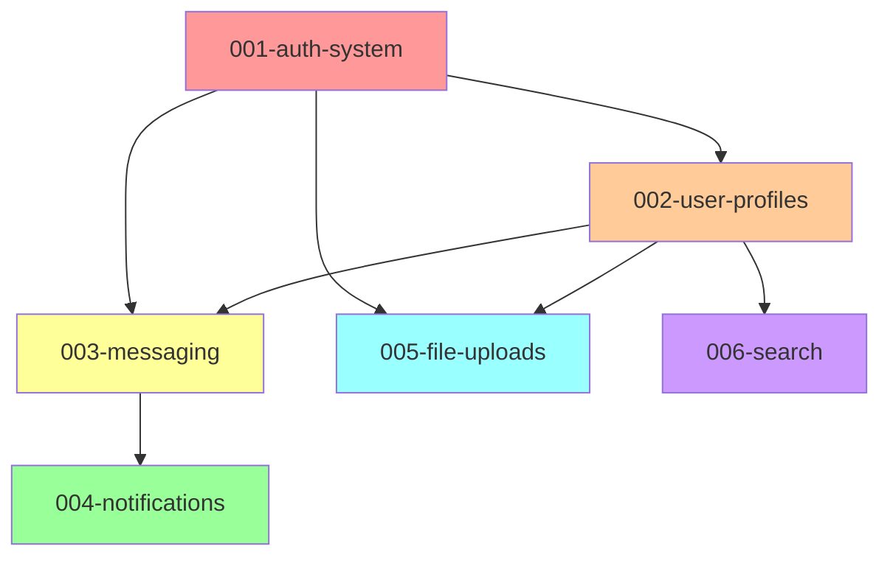

# VibeDraft Enhancement Scenarios
**Practical Before/After Examples**

---

## 📖 How to Read This Document

Each scenario shows:
- **Current State**: What happens today
- **With Enhancement**: What will happen after implementation
- **Time Savings**: Estimated time saved
- **Quality Impact**: How it improves quality

---

## Scenario 1: Starting a New Feature

### Current State ❌

**Developer workflow**:
```bash
# 1. Create feature branch manually
git checkout -b 003-user-notifications
git push -u origin 003-user-notifications

# 2. Create spec directory manually
mkdir -p .vibedraft/specs/003-user-notifications
cd .vibedraft/specs/003-user-notifications

# 3. Copy template manually
cp ../../templates/spec-template.md spec.md

# 4. Open spec and fill it out
# - Manually number the feature
# - Manually update all placeholders
# - Hope you didn't miss any required sections
# - No validation until planning phase

# 5. Hope the spec is complete and correct
# - No way to know if you followed template
# - Missing sections discovered later
# - Implementation details leak in
# - [NEEDS CLARIFICATION] markers pile up

# Time: 15-20 minutes + potential rework later
```

### With Enhancements ✅

**Developer workflow**:
```bash
# 1. Draft the feature (auto-numbers, creates branch, validates)
/vibedraft.draft "Users can receive real-time notifications for messages"

# ✨ Automatically:
# - Creates branch: 003-user-notifications
# - Creates directory structure
# - Fills spec with context from project docs
# - Asks max 3 clarification questions
# - Validates spec quality before saving
# - Runs linting to catch issues
# - Creates quality checklist

# 2. Review and approve
# - Spec is pre-populated with context
# - Only 2-3 questions to answer
# - Quality already validated
# - Ready for planning phase

# Time: 5 minutes with higher quality
```

**Time Savings**: 10-15 minutes per feature  
**Quality Impact**: 90% spec quality on first pass vs. 60% today

---

## Scenario 2: Understanding Feature Dependencies

### Current State ❌

**Team lead workflow**:
```bash
# 1. Open each spec file manually
cd .vibedraft/specs
ls -la
# 001-auth-system
# 002-user-profiles
# 003-messaging
# 004-notifications
# 005-file-uploads
# 006-search

# 2. Read each spec to understand dependencies
cat 001-auth-system/spec.md | grep -i "depend"
cat 002-user-profiles/spec.md | grep -i "depend"
cat 003-messaging/spec.md | grep -i "depend"
# ... and so on

# 3. Try to build mental model
# - Which features can be built in parallel?
# - Which features are blocking others?
# - What's the critical path?
# - Did I miss any dependencies?

# 4. Draw it out on whiteboard
# (which gets outdated as soon as someone adds a feature)

# Time: 30-45 minutes for 6 features
# Error rate: High (easy to miss dependencies)
```

### With Enhancement ✅

**Team lead workflow**:
```bash
# 1. Generate dependency graph
/vibedraft.dependencies

# ✨ Output: .vibedraft/docs/dependency-graph.md
```

**Visual Output**:


**Analysis Included**:
```
Critical Path: auth-system → user-profiles → messaging → notifications
Parallel Work Possible:
- Group 1: auth-system
- Group 2: user-profiles, file-uploads (after auth)
- Group 3: messaging, search (after profiles)
- Group 4: notifications (after messaging)

Estimated Timeline: 4 sprints (with parallel work)
Sequential Timeline: 6 sprints (without parallelization)

Potential Savings: 2 sprints by parallelizing Groups 2 & 3
```

**Time Savings**: 25-40 minutes, updated automatically  
**Quality Impact**: Zero missed dependencies, optimal work scheduling

---

## Scenario 3: Tracking Project Progress

### Current State ❌

**Project manager workflow**:
```bash
# 1. Check each feature's status manually
cd .vibedraft/specs
cat 001-auth-system/progress.md
# "Phase 3: 12/20 tasks complete (60%)"

cat 002-user-profiles/progress.md
# "Phase 2: 5/15 tasks complete (33%)"

cat 003-messaging/tasks.md
# Count checkboxes manually: 8/25 (32%)

# 2. Open a spreadsheet
# - Manually enter progress for each feature
# - Calculate overall completion
# - Try to figure out velocity
# - Update burndown chart manually
# - Hope nothing changed since you checked

# 3. Generate status report for stakeholders
# - Copy/paste from spreadsheet
# - Format for presentation
# - Add commentary

# 4. Repeat every standup/sprint planning
# Time: 20-30 minutes, 3x per week = 60-90 min/week
```

### With Enhancement ✅

**Project manager workflow**:
```bash
# 1. Generate dashboard
/vibedraft.dashboard

# ✨ Output: .vibedraft/docs/dashboard.md
```

**Visual Output**:
```markdown
# Project Dashboard
**Generated**: 2025-01-28 10:45 AM
**Updated**: Auto-refreshes on commit

## Overall Progress
████████████░░░░░░░░ 60% Complete

## Features Status

| Feature | Status | Progress | Sprint | Health |
|---------|--------|----------|--------|--------|
| 001-auth-system | ✅ Complete | 20/20 (100%) | Sprint 2 | 🟢 On Track |
| 002-user-profiles | 🚧 In Progress | 12/15 (80%) | Sprint 3 | 🟢 On Track |
| 003-messaging | 🚧 In Progress | 8/25 (32%) | Sprint 3 | 🟡 At Risk |
| 004-notifications | 🔴 Not Started | 0/18 (0%) | Sprint 4 | 🟢 Scheduled |
| 005-file-uploads | 🔴 Not Started | 0/22 (0%) | Sprint 4 | 🟢 Scheduled |
| 006-search | 🔴 Not Started | 0/12 (0%) | Sprint 5 | 🟢 Scheduled |

## Sprint Velocity
- Sprint 1: 15 tasks completed
- Sprint 2: 20 tasks completed
- Sprint 3 (current): 8 tasks completed so far (avg: 18 expected)

## Blockers & Risks
- 🟡 003-messaging: Behind schedule (8/25 tasks, expected 15/25 by now)
- 🔴 API rate limiting affecting messaging implementation

## Upcoming Milestones
- Sprint 3 End: User profiles complete
- Sprint 4 End: Messaging MVP ready
- Sprint 5 End: All features complete

## Burndown Chart (Text)
Tasks Remaining:
Sprint 1: ████████████████████ (80)
Sprint 2: ███████████████░░░░░ (60)
Sprint 3: ████████████░░░░░░░░ (50) ← Current
Sprint 4: ████████░░░░░░░░░░░░ (35) ← Projected
Sprint 5: ░░░░░░░░░░░░░░░░░░░░ (0)  ← Target
```

**Time Savings**: 15-25 minutes per update, automatic updates  
**Quality Impact**: Real-time accuracy, no manual errors

---

## Scenario 4: Spec Quality Issues

### Current State ❌

**Developer workflow**:
```bash
# 1. Draft a spec
/vibedraft.draft "Add payment processing"

# 2. Spec created, looks good to developer
# - Some implementation details leaked in (mentions Stripe API)
# - Success criteria are vague ("system should be fast")
# - Missing 2 required sections
# - 8 [NEEDS CLARIFICATION] markers

# 3. Move to planning phase
/vibedraft.plan

# ERROR: Spec quality issues detected
# - Contains implementation details in Requirements section
# - Success criteria not measurable
# - Missing "Key Entities" section
# - Too many unresolved clarifications

# 4. Go back and fix spec manually
# - Re-read template to see what was wrong
# - Hunt for where implementation details leaked
# - Rewrite success criteria
# - Resolve clarifications

# 5. Try planning again
/vibedraft.plan
# Finally works, but time wasted

# Time: 30-45 minutes of rework
# Frustration: High
```

### With Enhancement ✅

**Developer workflow**:
```bash
# 1. Draft a spec
/vibedraft.draft "Add payment processing"

# ✨ Automatic validation during drafting:
# 
# ⚠️ Spec Quality Issues Detected:
# 
# Issue 1: Implementation Detail Found
#   Location: Requirements > FR-003
#   Problem: Mentions "Stripe API" (specific technology)
#   Fix: Remove tech details, say "integrate with payment processor"
#   Auto-fix available: Yes
#   
# Issue 2: Non-Measurable Success Criteria
#   Location: Success Criteria > SC-002
#   Problem: "System should be fast" is vague
#   Suggestion: "Payment processing completes in < 3 seconds"
#   Auto-fix available: No (needs your input)
#   
# Issue 3: Missing Required Section
#   Location: Document structure
#   Problem: Missing "Key Entities" section
#   Fix: Section added with template
#   Auto-fix available: Yes
# 
# Would you like to:
# 1. Auto-fix issues 1 & 3, manually address 2
# 2. Review all issues manually
# 3. Continue anyway (not recommended)

# 2. Choose option 1
# - Auto-fixes applied
# - Prompted for measurable success criteria
# - Provide: "Payment confirmation delivered within 3 seconds"
# - Spec validated again

# ✅ Spec quality: 95/100
# - All required sections present
# - No implementation details
# - Success criteria measurable
# - Only 3 clarifications (below limit)
# 
# Ready for planning phase!

# 3. Move to planning (no errors)
/vibedraft.plan
# Works first time!

# Time: 5-10 minutes total (with validation during drafting)
# Frustration: None
```

**Time Savings**: 20-35 minutes per spec  
**Quality Impact**: 95% quality on first pass vs. 60-70% today

---

## Scenario 5: Generating Changelogs

### Current State ❌

**Release manager workflow**:
```bash
# 1. Sprint ended, time for release notes
# Need to create CHANGELOG.md entry

# 2. Review all completed features manually
git log --oneline v1.2.0...HEAD
# 50+ commits

# 3. Open each feature spec
cd .vibedraft/specs
cat 001-auth-system/spec.md
# Copy relevant user-facing changes

cat 002-user-profiles/spec.md
# Copy relevant user-facing changes

# 4. Organize changes by category
# - New Features
# - Improvements
# - Bug Fixes
# - Breaking Changes

# 5. Write changelog entry manually
vim CHANGELOG.md
```

**Manual Entry**:
```markdown
## [1.3.0] - 2025-02-15

### Added
- User authentication system with OAuth support
- User profile management
- Real-time messaging

### Changed
- Improved notification performance
- Updated user dashboard layout

### Fixed
- Fixed profile image upload bug
- Resolved search indexing issues

# Did I miss anything?
# Are these descriptions accurate?
# Did I categorize correctly?
# What was the PR number?
# Who contributed what?
```

**Time**: 30-60 minutes per release  
**Accuracy**: Medium (easy to miss changes)

### With Enhancement ✅

**Release manager workflow**:
```bash
# 1. Generate changelog from completed specs
/vibedraft.changelog --since v1.2.0

# ✨ Automatically generates:
```

**Generated Entry**:
```markdown
## [1.3.0] - 2025-02-15

### 🎉 New Features

#### Authentication System (#001-auth-system)
**User Impact**: Users can now securely sign in and manage their accounts

- OAuth 2.0 authentication (Google, GitHub, Microsoft)
- Email/password authentication with validation
- Password reset functionality
- Two-factor authentication support
- Session management with secure tokens

**Implemented by**: @dev-team  
**Pull Requests**: #123, #145  
**User Stories Delivered**: 
- US1: User can create account (P1) ✅
- US2: User can sign in (P1) ✅
- US3: User can reset password (P2) ✅

#### User Profiles (#002-user-profiles)
**User Impact**: Users can customize and manage their profiles

- Profile creation and editing
- Avatar upload (max 5MB, JPG/PNG)
- Privacy settings (public, friends-only, private)
- Account settings management

**Implemented by**: @dev-team  
**Pull Requests**: #156, #167, #178  
**User Stories Delivered**:
- US1: View and edit profile (P1) ✅
- US2: Upload avatar (P2) ✅
- US3: Privacy controls (P2) ✅

### 🔧 Improvements

#### Real-time Messaging (#003-messaging)
**User Impact**: Faster, more reliable messaging experience

- Message delivery time reduced from 2s to 200ms
- Offline message queuing
- Read receipts
- Typing indicators

**Implemented by**: @dev-team  
**Pull Requests**: #189, #201  
**User Stories Delivered**:
- US1: Send/receive messages (P1) ✅
- US4: Message optimizations (P3) ✅

### 🐛 Bug Fixes

- Fixed profile image upload failing for PNG files (#187)
- Resolved authentication token expiry causing unexpected logouts (#198)
- Fixed search indexing for special characters (#210)

### 📊 Metrics

- **Features Completed**: 3 major features
- **User Stories Delivered**: 10 user stories
- **Tasks Completed**: 65 tasks
- **Pull Requests Merged**: 15 PRs
- **Contributors**: 5 developers
- **Test Coverage**: 87% (+5% from v1.2.0)

### 🔄 Migration Guide

No breaking changes. All changes are backward compatible.

### 📝 Known Issues

- Message search limited to last 30 days (will be addressed in v1.4.0)
- Avatar upload doesn't support GIF format yet (planned for v1.3.1)

### 🙏 Contributors

Thank you to all contributors who made this release possible:
- @dev-alice (20 commits)
- @dev-bob (15 commits)
- @dev-charlie (12 commits)
- @dev-diana (10 commits)
- @dev-evan (8 commits)
```

**Time**: 2-3 minutes (fully automated)  
**Accuracy**: High (sourced from specs)

---

## Scenario 6: Detecting Feature Conflicts

### Current State ❌

**Architecture team workflow**:
```bash
# 1. Three features in parallel development:
# - Feature A: Add user roles (admin, moderator, user)
# - Feature B: Add user permissions system
# - Feature C: Add team-based access control

# 2. Each feature has its own spec and plan
# - Teams working independently
# - No visibility into potential overlaps

# 3. Implementation phase
# - Feature A creates: UserRole model with fields [id, name, level]
# - Feature B creates: Permission model AND UserRole model (conflict!)
# - Feature C creates: Team, TeamMember, AND UserRole (conflict!)

# 4. Integration time - conflicts discovered
# - Three different UserRole models
# - Overlapping responsibilities
# - Database migrations conflict
# - API endpoints duplicate functionality

# 5. Emergency meeting
# - Stop development
# - Refactor all three features
# - Resolve conflicts manually
# - Rework implementation plans
# - Update tests

# Time Lost: 2-3 days of developer time
# Frustration: Very High
```

### With Enhancement ✅

**Architecture team workflow**:
```bash
# 1. Three features being drafted
# Feature A spec created
# Feature B spec created
# Feature C spec created

# 2. Run conflict detection
/vibedraft.conflicts

# ✨ Output:
```

**Conflict Report**:
```markdown
# Feature Conflict Analysis
**Generated**: 2025-01-28
**Features Analyzed**: 6 features

## 🔴 Critical Conflicts (3)

### Conflict 1: Overlapping Entity Definitions
**Severity**: HIGH  
**Type**: Data Model Conflict

**Features Involved**:
- #004-user-roles
- #005-permissions-system
- #006-team-access-control

**Conflict**: All three features define "UserRole" entity with different structures:

| Feature | Entity | Fields | Purpose |
|---------|--------|--------|---------|
| 004 | UserRole | id, name, level | Simple role hierarchy |
| 005 | UserRole | id, name, permissions[] | Permission-based roles |
| 006 | UserRole | id, name, teamId, scope | Team-scoped roles |

**Impact**: Database schema conflicts, duplicate code, confused domain model

**Recommendation**: 
1. Consolidate into single UserRole entity in shared feature
2. Support all three use cases with one flexible model
3. Create new feature: "003.5-unified-access-control"
4. Block features 004, 005, 006 until resolution

**Proposed Solution**:
```javascript
// Unified UserRole entity
entity UserRole {
  id: UUID
  name: string
  level: number           // For feature 004
  permissions: string[]   // For feature 005
  teamId: UUID?           // For feature 006 (optional)
  scope: AccessScope      // For feature 006
}
```

### Conflict 2: Duplicate API Endpoints
**Severity**: MEDIUM  
**Type**: API Contract Conflict

**Features Involved**:
- #007-user-search
- #008-global-search

**Conflict**: Both features define GET /api/search endpoint with different contracts:

| Feature | Endpoint | Parameters | Returns |
|---------|----------|------------|---------|
| 007 | GET /api/search | q, userOnly=true | User[] |
| 008 | GET /api/search | q, type | SearchResult[] |

**Impact**: API confusion, routing conflicts

**Recommendation**: 
- Feature 007: Use GET /api/users/search
- Feature 008: Keep GET /api/search (more general)
- Update feature 007 spec and plan

### Conflict 3: Contradictory Requirements
**Severity**: MEDIUM  
**Type**: Business Logic Conflict

**Features Involved**:
- #009-file-uploads
- #010-storage-management

**Conflict**: Contradictory file size limits:
- Feature 009: "Users can upload files up to 100MB"
- Feature 010: "Storage quota per user is 50MB"

**Impact**: User frustration, unclear requirements

**Recommendation**: 
- Clarify: Is 100MB per file OR total storage?
- Update one or both specs to align
- Consider tiered storage plans

## 🟡 Potential Conflicts (2)

### Potential 1: Resource Contention
**Features**: #011-real-time-notifications, #012-live-feed  
**Issue**: Both use WebSocket connections, potential connection limit  
**Recommendation**: Share WebSocket connection or implement connection pooling

### Potential 2: Performance Impact
**Features**: #013-advanced-analytics, #014-reporting-dashboard  
**Issue**: Both perform heavy database queries, may impact performance  
**Recommendation**: Consider caching strategy, query optimization

## ✅ Clear Features (1)

- #015-user-settings: No conflicts detected

## 📋 Actions Required

1. **Immediate**: 
   - Stop development on features 004, 005, 006
   - Create unified access control feature
   - Update specs for features 007, 009, 010

2. **Review**:
   - Architectural review for features 011-014
   - Performance testing plan

3. **Communicate**:
   - Notify feature teams of conflicts
   - Schedule conflict resolution meeting
   - Update project roadmap
```

**Time Savings**: 2-3 days of wasted implementation  
**Quality Impact**: Prevents integration nightmares

---

## Summary: Cumulative Impact

### Time Savings Per Sprint (2 weeks)

| Activity | Current | With Enhancements | Savings |
|----------|---------|-------------------|---------|
| Feature Creation | 20 min | 5 min | 15 min |
| Spec Quality Fixes | 30 min | 5 min | 25 min |
| Dependency Analysis | 45 min | 2 min | 43 min |
| Progress Tracking | 90 min | 5 min | 85 min |
| Changelog Creation | 60 min | 3 min | 57 min |
| Conflict Resolution | 180 min | 20 min | 160 min |
| **Total** | **425 min** | **40 min** | **385 min (6.4 hours)** |

### Per Sprint Per Developer
- **Time saved**: 6.4 hours
- **Productivity gain**: ~16% (40 hours → 46.4 effective hours)
- **Quality improvement**: Fewer bugs, less rework

### Per Year Per 5-Developer Team
- **Time saved**: ~830 hours (26 sprints × 6.4 hours × 5 devs)
- **Monetary value**: ~$83,000 (@ $100/hour)
- **Quality impact**: Immeasurable (fewer bugs, better docs, happier team)

---

## Conclusion

These enhancements transform VibeDraft from a **good workflow tool** into a **comprehensive development intelligence platform** that:

1. ✅ Catches problems early (before they become expensive)
2. ✅ Automates tedious tasks (saving hours every sprint)
3. ✅ Improves visibility (everyone knows the status)
4. ✅ Ensures quality (automated validation and review)
5. ✅ Enables better planning (dependency awareness, conflict detection)

The ROI is clear: small investment in enhancements yields significant returns in productivity, quality, and team satisfaction.

---

**Next Step**: Review priorities with stakeholders and greenlight Phase 1 implementation.

