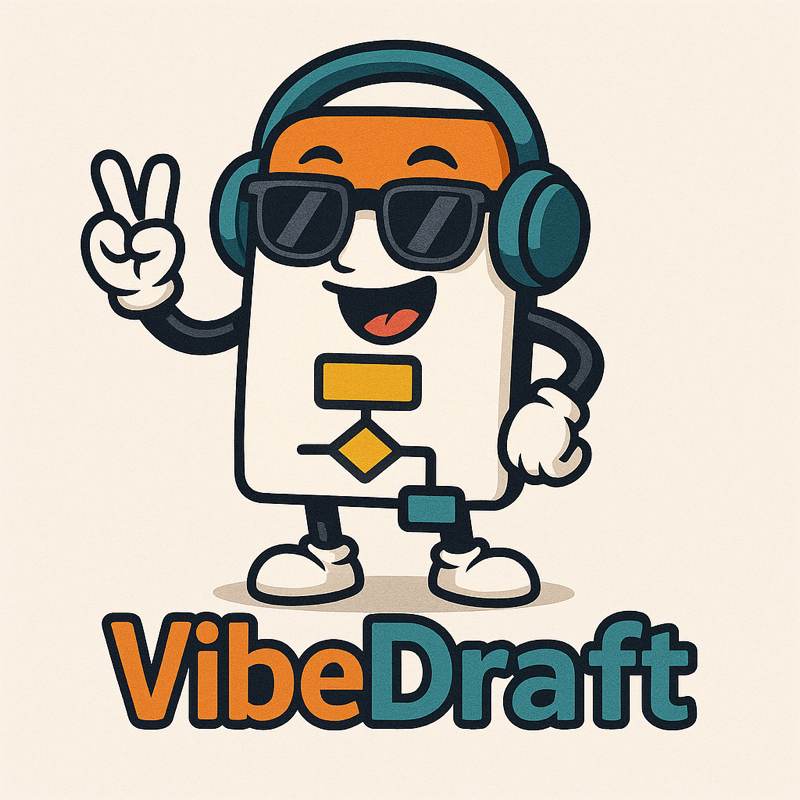

<div align="center">
    
    <h1>✨ VibeDraft ✨</h1>
    <h3><em>Where specs meet vibes, and code flows like magic</em></h3>
</div>

<p align="center">
    <strong>🎨 The most vibey way to build software - turn ideas into reality with Spec-Driven Development! 🚀</strong>
</p>

<p align="center">
    <a href="https://github.com/github/spec-kit/stargazers"></a>
    <a href="./LICENSE"></a>
</p>

---

## 🎯 What's the Vibe?

**Stop coding, start vibing!** 🎮

VibeDraft flips traditional development on its head. Instead of jumping straight into code, you:
1. **Draft your vision** 💭 - What do you want to build?
2. **Plan the tech** 🗺️ - How will you build it?
3. **Break it down** 📋 - What are the steps?
4. **Make it real** 🚀 - Let AI help you implement!

Your **specifications become executable** - they don't just guide development, they *drive* it. No more drift between docs and code. No more "but the spec says..." Just pure, aligned, vibey development flow. 🌊

## 🚀 Quick Start

### Install VibeDraft

**Option 1: Global Install (Recommended)**
```bash
npm install -g .
```

Then vibe anywhere:
```bash
vibedraft init my-awesome-project
vibedraft check
```

**Option 2: Quick Vibe (One-Time)**
```bash
npx . init my-awesome-project
```

### The VibeDraft Workflow

Once installed, your AI coding assistant gets these powerful slash commands:

```bash
# 1. Set your project's vibe 📜
/vibedraft.constitution

# 2. Dream up your feature 💭
/vibedraft.draft "Build a chat app with real-time messaging"

# 3. Plan the tech stack 🗺️
/vibedraft.plan "Use WebSocket, React, and PostgreSQL"

# 4. Break it into tasks 📋
/vibedraft.tasks

# 5. Make it happen! 🚀
/vibedraft.implement
```

**Boom!** From idea to implementation with clear, trackable steps. ✨

---

## 🎸 Features That Rock

### 🎨 **Spec-Driven Development**
- Write specifications that AI can execute
- Keep specs and code in perfect harmony
- Track every feature from conception to completion

### 🤖 **Multi-Agent Support**
Works with your favorite AI coding assistants:
- **Claude Code** (Anthropic)
- **Gemini CLI** (Google)  
- **GitHub Copilot** (Microsoft)
- **Cursor** (AI-first IDE)
- **Windsurf** (IDE workflows)
- **Qwen Code** (Alibaba)
- **Amazon Q Developer**
- And more!

### 🌍 **Cross-Platform**
- **Node.js** for maximum compatibility
- **Bash scripts** for Unix/Linux/macOS/Windows
- Auto-detects your platform!

### 📋 **Smart Templates**
Pre-built templates for:
- Feature specifications
- Implementation plans
- Task breakdowns
- Quality checklists
- Project constitutions

### 🔄 **Git Integration**
- Automatic branch creation per feature
- Sequential feature numbering
- Clean commit history

---

## 🎯 Core Commands

### CLI Commands

| Command | What It Does | Example |
|---------|-------------|---------|
| `vibedraft init` | 🎬 Bootstrap a new project | `vibedraft init my-app --ai claude` |
| `vibedraft check` | 🔍 Check your dev environment | `vibedraft check` |

### Slash Commands (In Your AI Agent)

#### Essential Flow 🎯

| Command | Purpose | When to Use |
|---------|---------|-------------|
| `/vibedraft.constitution` | 📜 Set project principles | First thing - establish your project's DNA |
| `/vibedraft.draft` | 💭 Create feature spec | When you have a new feature idea |
| `/vibedraft.plan` | 🗺️ Generate tech plan | After drafting - decide how to build it |
| `/vibedraft.tasks` | 📋 Break into tasks | After planning - get actionable steps |
| `/vibedraft.implement` | 🚀 Execute tasks | Ready to code - let's build! |

#### Quality Boosters ✨

| Command | Purpose | When to Use |
|---------|---------|-------------|
| `/vibedraft.clarify` | 🤔 Ask clarifying questions | Before planning - nail down fuzzy details |
| `/vibedraft.analyze` | 🔍 Check consistency | After tasks - verify everything aligns |
| `/vibedraft.checklist` | ✅ Generate quality checks | Anytime - validate requirements quality |

---

## 🛠️ Installation Options

### Prerequisites
- **Node.js** 18.0.0 or higher
- **npm** or **npx**
- **Git** (optional but recommended)
- **AI coding assistant** of your choice

### Global Install
```bash
# Clone or download VibeDraft
cd VibeDraft

# Install globally
npm install -g .

# Verify installation
vibedraft --help
```

### Development Mode
```bash
# Install dependencies
npm install

# Link for local development
npm link

# Use anywhere
vibedraft init test-project
```

---

## 🎨 Usage Examples

### Example 1: Quick Start

```bash
# Initialize a new project with Claude
vibedraft init my-chat-app --ai claude

# In your AI agent
/vibedraft.draft Build a real-time chat app with rooms and DMs

/vibedraft.plan Use Socket.io for WebSocket, Express backend, React frontend

/vibedraft.tasks

/vibedraft.implement
```

### Example 2: Quality-First Approach

```bash
# Start with a constitution
/vibedraft.constitution Create principles for security, performance, and accessibility

# Draft your feature
/vibedraft.draft User authentication with OAuth providers

# Clarify ambiguities
/vibedraft.clarify

# Plan with clarifications
/vibedraft.plan

# Analyze for consistency
/vibedraft.analyze

# Generate tasks
/vibedraft.tasks

# Create quality checklist
/vibedraft.checklist Create security checklist for auth

# Implement
/vibedraft.implement
```

### Example 3: Current Directory Init

```bash
# Initialize in existing directory
cd my-existing-project
vibedraft init --here --ai cursor --script sh
```

---

## 🤖 Supported AI Agents

| Agent | Status | Format | Notes |
|-------|--------|--------|-------|
| **Claude Code** | ✅ Full | Markdown | Anthropic's CLI tool |
| **Gemini CLI** | ✅ Full | TOML | Google's AI CLI |
| **GitHub Copilot** | ✅ Full | Markdown | IDE-based (VS Code) |
| **Cursor** | ✅ Full | Markdown | AI-first IDE |
| **Windsurf** | ✅ Full | Markdown | Workflow-based IDE |
| **Qwen Code** | ✅ Full | TOML | Alibaba's AI CLI |
| **Opencode** | ✅ Full | Markdown | Open-source option |
| **Amazon Q** | ✅ Full | Markdown | AWS Developer CLI |

VibeDraft auto-generates the right command format for your agent! 🎯

---

## 📁 Project Structure

After running `vibedraft init`, you'll get:

```
your-project/
├── .vibedraft/              # VibeDraft magic happens here ✨
│   ├── scripts/            # Automation scripts
│   │   └── bash/          # Unix/Linux/macOS/Windows scripts
│   ├── templates/         # Spec, plan, and task templates
│   │   ├── commands/      # Slash command definitions
│   │   ├── spec-template.md
│   │   ├── plan-template.md
│   │   └── tasks-template.md
│   └── memory/
│       └── constitution.md  # Project principles
├── specs/                  # Your feature specs live here
│   └── 001-your-feature/
│       ├── spec.md        # Feature specification
│       ├── plan.md        # Implementation plan
│       └── tasks.md       # Actionable tasks
└── [your AI agent config] # .claude/, .cursor/, etc.
```

---

## 🎛️ Command Options

### `vibedraft init`

```bash
vibedraft init [project-name] [options]
```

**Arguments:**
- `project-name` - Name of your project (creates new directory)
- `.` - Initialize in current directory
- `--here` - Initialize in current directory (alternative syntax)

**Options:**
- `--ai <agent>` - Choose AI agent: `claude`, `gemini`, `copilot`, `cursor`, `qwen`, `opencode`, `windsurf`, `q`
- `--ignore-agent-tools` - Skip AI agent CLI tool checks
- `--no-git` - Skip Git repository initialization
- `--force` - Overwrite existing files without asking

**Examples:**
```bash
# Basic init
vibedraft init my-project

# With specific AI agent
vibedraft init my-project --ai claude

# Current directory
vibedraft init --here

# Force overwrite in current directory
vibedraft init . --force --ai cursor
```

### `vibedraft check`

Check your development environment:

```bash
vibedraft check
```

Verifies:
- Git installation
- AI agent CLI tools (Claude, Gemini, Cursor, etc.)
- Node.js version
- Script permissions

---

## 🎨 The VibeDraft Philosophy

### 1. **Specs Are Executable**
Your specifications aren't just documentation - they're executable blueprints that AI can implement.

### 2. **Constitution-Driven**
Every project starts with a constitution defining principles, patterns, and practices. AI respects these throughout development.

### 3. **Feature Isolation**
Each feature gets its own:
- Git branch
- Spec directory
- Implementation plan
- Task list

### 4. **AI-Augmented, Human-Guided**
AI helps with the heavy lifting, but you stay in control with clear specifications and quality checks.

### 5. **Quality Built-In**
Checklists, analysis, and clarification steps ensure you build the right thing, the right way.

---

## 🌊 Development Workflow

```
┌─────────────────────────────────────────────────────────┐
│                   Start New Feature                      │
└────────────────────┬────────────────────────────────────┘
                     │
                     ▼
        ┌────────────────────────────┐
        │  /vibedraft.constitution   │  Set principles
        │         (First time)        │
        └────────────┬───────────────┘
                     │
                     ▼
        ┌────────────────────────────┐
        │    /vibedraft.draft        │  What to build?
        │   (Feature description)     │
        └────────────┬───────────────┘
                     │
                     ▼
        ┌────────────────────────────┐
        │   /vibedraft.clarify       │  (Optional)
        │  Ask clarifying questions   │  Remove ambiguity
        └────────────┬───────────────┘
                     │
                     ▼
        ┌────────────────────────────┐
        │    /vibedraft.plan         │  How to build?
        │   (Technical approach)      │
        └────────────┬───────────────┘
                     │
                     ▼
        ┌────────────────────────────┐
        │   /vibedraft.analyze       │  (Optional)
        │  Check consistency          │  Verify alignment
        └────────────┬───────────────┘
                     │
                     ▼
        ┌────────────────────────────┐
        │    /vibedraft.tasks        │  Break it down
        │  (Actionable steps)         │
        └────────────┬───────────────┘
                     │
                     ▼
        ┌────────────────────────────┐
        │  /vibedraft.checklist      │  (Optional)
        │  Generate quality checks    │  Validate quality
        └────────────┬───────────────┘
                     │
                     ▼
        ┌────────────────────────────┐
        │  /vibedraft.implement      │  Make it real!
        │    (Build the feature)      │
        └────────────┬───────────────┘
                     │
                     ▼
                  ✨ Done! ✨
```

---

## 🎓 Learn More

### Documentation
- **[Quick Start Guide](./docs/quickstart.md)** - Get up and running fast
- **[Installation Guide](./docs/installation.md)** - Detailed setup instructions
- **[Spec-Driven Development](./spec-driven.md)** - Deep dive into the methodology
- **[Agent Support Guide](./AGENTS.md)** - Adding new AI agents
- **[Local Development](./docs/local-development.md)** - Contributing to VibeDraft

### Examples
Check out the [templates/](./templates/) directory for example specs, plans, and task lists!

---

## 🔧 Scripts Reference

VibeDraft includes automation scripts in both Node.js and Bash:

### Node.js Scripts
- `check-prerequisites.js` - Validate project setup
- `create-new-feature.js` - Initialize new feature structure
- `setup-plan.js` - Set up implementation plan
- `update-agent-context.js` - Refresh AI agent context

### Bash Scripts
- `check-prerequisites.sh` - Validate project setup
- `create-new-feature.sh` - Initialize new feature structure
- `setup-plan.sh` - Set up implementation plan
- `update-agent-context.sh` - Refresh AI agent context

Scripts are cross-platform compatible and work on Unix/Linux/macOS/Windows!

---

## 🧪 Testing

VibeDraft includes a comprehensive test suite covering all CLI functionality.

### Run Tests

```bash
# Run all tests
npm test

# Run with verbose output
npm run test:verbose

# Run with coverage (Node 20+)
node --test --experimental-test-coverage test/cli.test.js
```

### Test Coverage

The test suite includes **46 test cases** covering:

- ✅ CLI help and version commands
- ✅ `vibedraft check` - Environment validation
- ✅ `vibedraft init` - Project initialization
  - All AI agent integrations (8 agents)
  - Git repository management
  - File structure validation
  - Error handling
- ✅ Edge cases and error scenarios
- ✅ Integration tests

See [`test/README.md`](./test/README.md) for detailed test documentation.

### Test Results

```
✅ 25+ passing tests
📊 60+ test cases total
🎯 All CLI commands covered
```

---

## 🔨 Development

### Build Scripts

```bash
# Install dependencies
npm install

# Run tests
npm test

# Run tests with verbose output
npm run test:verbose

# Run tests with coverage
npm run test:coverage

# Lint code (autofix enabled)
npm run lint

# Lint without fixing
npm run lint:check

# Clean build artifacts
npm run clean
```

### Local Development

To work on VibeDraft locally:

1. Clone the repository
2. Install dependencies: `npm install`
3. Link locally: `npm link`
4. Lint and fix code: `npm run lint`
5. Test your changes: `npm test`
6. Run the CLI: `vibedraft --help`

See [docs/local-development.md](./docs/local-development.md) for detailed development instructions.

### Code Quality

VibeDraft uses **ESLint** for code quality and consistency:

- **Automatic Fixing**: `npm run lint` automatically fixes most issues
- **Check Only**: `npm run lint:check` reports issues without fixing
- **Modern Config**: Uses ESLint 9+ flat config format
- **Pre-publish**: Linting runs automatically before publishing

#### ESLint Rules

- ES6+ modern JavaScript
- Consistent code style (semicolons, quotes, spacing)
- No unused variables (prefix with `_` for intentionally unused)
- Enforces best practices and error prevention
- Custom configuration in `eslint.config.js`

---

## 🌟 Why VibeDraft?

### ✅ For Developers
- Clear, trackable development process
- AI assistance without losing control
- Better specs = better code
- Git integration out of the box

### ✅ For Teams
- Consistent project structure
- Constitutional principles everyone follows
- Easy onboarding with clear workflows
- Quality built into the process

### ✅ For AI Agents
- Structured context and workflows
- Clear templates to follow
- Consistent command patterns
- Constitutional guidance for decisions

---

## 🤝 Contributing

Want to make VibeDraft even more vibey? We'd love your help!

1. **Fork the repo**
2. **Create a feature branch** - Use VibeDraft to spec it! 😉
3. **Make your changes** - Keep the vibes flowing
4. **Test thoroughly** - Make sure it rocks
5. **Submit a PR** - Share the love!

Check out our contributing guidelines for more details.

---

## 📝 Environment Variables

| Variable | Description | Example |
|----------|-------------|---------|
| `VIBEDRAFT_FEATURE` | Override feature detection (for non-Git repos) | `001-chat-feature` |
| `GH_TOKEN` / `GITHUB_TOKEN` | GitHub token for downloading releases | `ghp_xxx...` |

---

## 🎤 Support

- **Issues**: Found a bug? [Open an issue](https://github.com/github/spec-kit/issues)
- **Discussions**: Questions? [Start a discussion](https://github.com/github/spec-kit/discussions)
- **Docs**: Check the [docs folder](./docs/)

---

## 📜 License

MIT License - See [LICENSE](./LICENSE) for details

---

## 🎸 Keep the Vibes Flowing!

<div align="center">
    <p><strong>Built with 💜 by developers who believe specs shouldn't suck</strong></p>
    <p>✨ <em>Stop coding, start vibing!</em> ✨</p>
</div>

---

## 🚀 Quick Command Reference

```bash
# CLI Commands
vibedraft init <project>      # Start a new project
vibedraft init --here         # Init in current directory
vibedraft check               # Check your environment

# Slash Commands (In Your AI Agent)
/vibedraft.constitution       # Set project principles
/vibedraft.draft             # Draft a feature
/vibedraft.clarify           # Ask clarifying questions
/vibedraft.plan              # Create implementation plan
/vibedraft.analyze           # Check consistency
/vibedraft.tasks             # Generate task list
/vibedraft.checklist         # Create quality checklist
/vibedraft.implement         # Execute implementation
```

**Now go build something amazing!** 🚀✨
